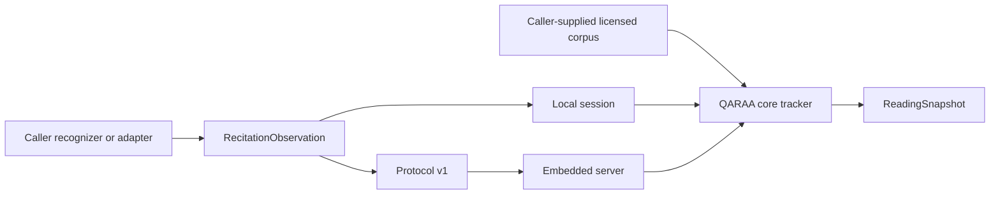

# QARAA

<p align="center">
  
</p>

*Bismillāh ir-Raḥmān ir-Raḥīm.*

QARAA is an Apache-2.0 library and protocol toolkit for deterministic Qur’an
recitation alignment: it turns caller-provided recognition observations and a
licensed corpus into stable reading progress and carefully bounded findings.

> **Experimental status:** all packages are at `0.1.0`, protocol v1 is an early
> contract, and no packages are currently published. Review the schemas and
> conformance fixtures before integrating.

## Why QARAA

Recitation products often need to connect a recognizer, a corpus, user-facing
reading state, and a chosen application framework. QARAA provides the narrow,
deterministic layer between them: it aligns normalized observations against a
caller-owned corpus, manages revision-safe progress, and exposes an explicit
confidence decision rather than making a claim about recitation quality.

It is a technical means, subordinate to qualified teachers. It does not judge
worship, religious validity, or a person's recitation.

## Core capabilities

- Deterministic, phoneme-aware alignment and location search.
- Confidence-gated display progress, word commits, and confirmed substitution
  findings.
- Immutable, revision-safe reading snapshots for local or remote sessions.
- Protocol v1 contracts with JSON Schemas, conformance fixtures, and typed
  errors.
- Optional structural normalization for recognizer-shaped results, without
  bundling a recognizer or model.

## Install

Package publication has not begun. To develop against this checkout:

```bash
corepack enable
pnpm install --frozen-lockfile
```

When packages are published, install the client surface appropriate to your
application—for example, `@atqan/qaraa-client` for local or remote JavaScript
sessions. See [Packages](#packages) for the available surfaces.

## Quick start

The local path needs no server or recognizer integration. Supply a corpus you
are entitled to use, then submit a final normalized observation:

```ts
import { createLocalSession } from '@atqan/qaraa-client';

const corpus = {
  corpusId: 'licensed-corpus',
  revision: '1',
  symbols: [
    {
      id: 's1',
      text: 'ق',
      phoneme: 'q',
      location: { surah: 1, ayah: 1, word: 1, symbol: 1 },
    },
  ],
  words: [
    {
      id: 'w1',
      text: 'ق',
      symbolIds: ['s1'],
      location: { surah: 1, ayah: 1, word: 1 },
    },
  ],
};

const session = createLocalSession({ corpus });
const snapshot = await session.submit({
  observationId: 'obs-1',
  sourceRevision: 1,
  isFinal: true,
  receivedAtMs: Date.now(),
  tokens: [{ id: 't1', text: 'ق', phonemes: ['q'], confidence: 0.99 }],
});

console.log(snapshot.display.location, snapshot.commit.completedWordIds);
await session.close();
```

For an embedded REST/WebSocket service, use `createQaraaServer` as described
in the [architecture guide](docs/architecture.md). For a caller-supplied remote
transport, use `createRemoteSession` and the
[protocol v1 guide](docs/protocol-v1.md).

## How it works



The core alone advances reading state. Clients, protocol transports, servers,
and framework adapters preserve that boundary; they do not reimplement
alignment. Display progress and committed progress remain separate, and stale
or repeated observations cannot advance a session. Read the
[architecture](docs/architecture.md) for the full responsibility and failure
boundaries.

## Packages

### Foundation

| Package | Role |
| --- | --- |
| `@atqan/qaraa-core` | Corpus validation/indexing, alignment, confidence gates, findings, and tracker state. |
| `@atqan/qaraa-protocol` | Protocol v1 TypeScript contracts, JSON Schemas, validators, and typed errors. |
| `@atqan/qaraa-client` | Unified local and remote `QaraaSession` lifecycle. |
| `@atqan/qaraa-server` | Embeddable Fastify REST/WebSocket server with in-memory sessions. |
| `@atqan/qaraa-sherpa-onnx` | Structural recognizer-result normalization; no recognizer or model loading. |

### Framework adapters

| Package | Framework primitive |
| --- | --- |
| `@atqan/qaraa-react` | `useQaraaSession` hook |
| `@atqan/qaraa-preact` | `useQaraaSession` hook |
| `@atqan/qaraa-vue` | `useQaraaSession` composable |
| `@atqan/qaraa-angular` | `QaraaSessionService` |
| `@atqan/qaraa-svelte` | `createQaraaStore` |
| `@atqan/qaraa-solid` | `createQaraaSession` |
| `@atqan/qaraa-lit` | `QaraaSessionController` |

### Native SDKs

| SDK | Role |
| --- | --- |
| [Python](sdk/python) | Typed protocol-v1 client with sync and async APIs. |
| [Go](sdk/go) | Context-aware protocol-v1 client. |
| [Dart](sdk/dart) | Async protocol-v1 client for Dart and Flutter use. |

## Frameworks and SDKs

Framework adapters accept an already-created local or remote session, expose
shared state and actions, and leave session lifetime to the caller. Their
module imports are SSR-inert; cleanup releases a subscription rather than
closing the session. See [framework adapters](docs/framework-adapters.md) for
peer ranges, lifecycle ownership, SSR boundaries, and current toolchain checks.

Python, Go, and Dart SDKs are remote protocol clients for the TypeScript
server. They do not run alignment, confidence gates, corpus handling,
recognition, or UI locally. The [native SDK guide](docs/sdks.md) records retry,
streaming, and runtime-validation boundaries; Dart/Flutter validation runs in
CI when its runtime is unavailable locally.

## Compatibility

| Surface | Contract |
| --- | --- |
| Node.js | `>=22.13.0`; CI covers Node 22 and 24. |
| TypeScript | Runtime packages compile with TypeScript 7.0.2 through `@typescript/native`. |
| JavaScript modules | Conditional ESM/CommonJS exports with matching declarations; Angular uses the ESM-only Angular Package Format. |
| Protocol | JSON envelopes and schemas use `PROTOCOL_VERSION === 1`. |
| Python | 3.10–3.14 native SDK runtime. |
| Go | 1.24–1.26 native SDK runtime. |
| Dart | 3.10–3.12 native SDK runtime; CI is its runtime gate when unavailable locally. |

## Design principles

- **Model-neutral:** recognizers remain caller-selected; QARAA includes no
  model weights, tokenizer tied to a model, or recognizer runtime.
- **Corpus-neutral:** consumers supply, license, and retain responsibility for
  corpus provenance and normalization policy.
- **Revision-safe:** observations and snapshots have explicit revision and
  idempotency boundaries.
- **Confidence-gated:** thresholds are deterministic decision gates, not
  calibrated probabilities or accuracy guarantees. See
  [confidence decisions](docs/confidence.md).
- **Lifecycle-aware:** framework adapters own subscriptions only; connection
  and session closure stay explicit.

## Scope and non-goals

QARAA does not provide a Qur’an corpus, model weights, a hosted service,
authentication, billing, durable storage, or a religious ruling. The embedded
server uses bounded in-memory state; products that need persistence or access
control must supply those policies at their own boundary.

## Develop and verify

```bash
pnpm --config.verify-deps-before-run=false check
pnpm --config.verify-deps-before-run=false test
pnpm --config.verify-deps-before-run=false test:conformance
pnpm --config.verify-deps-before-run=false build
pnpm --config.verify-deps-before-run=false run audit
node scripts/audit-native-packages.mjs --source-only
```

`pnpm tarball:smoke` creates package archives and temporary consumers; no
command above publishes a package.

## Documentation

- [Architecture](docs/architecture.md)
- [Protocol v1](docs/protocol-v1.md)
- [Framework adapters](docs/framework-adapters.md)
- [Native SDKs](docs/sdks.md)
- [Confidence decisions](docs/confidence.md)

## Contributing and security

Read [CONTRIBUTING.md](CONTRIBUTING.md) and
[CODE_OF_CONDUCT.md](CODE_OF_CONDUCT.md) before participating. Report
vulnerabilities through the process in [SECURITY.md](SECURITY.md).

## License and stewardship

QARAA-authored work is licensed under Apache License 2.0. The license permits
use, modification, and redistribution, includes an express patent grant, and
requires preservation of applicable license and notice material; it is provided
without warranty. The [license text](LICENSE) controls.

Runtime dependency notices are recorded in
[THIRD_PARTY_NOTICES.md](THIRD_PARTY_NOTICES.md). QARAA does not distribute a
recognition model, private credentials, or a Qur’an dataset; those assets and
their provenance remain the consumer's responsibility.

<p align="center">
هَٰذَا مِن فَضْلِ رَبِّي<br>
Hadza min fadli rabbi
</p>
