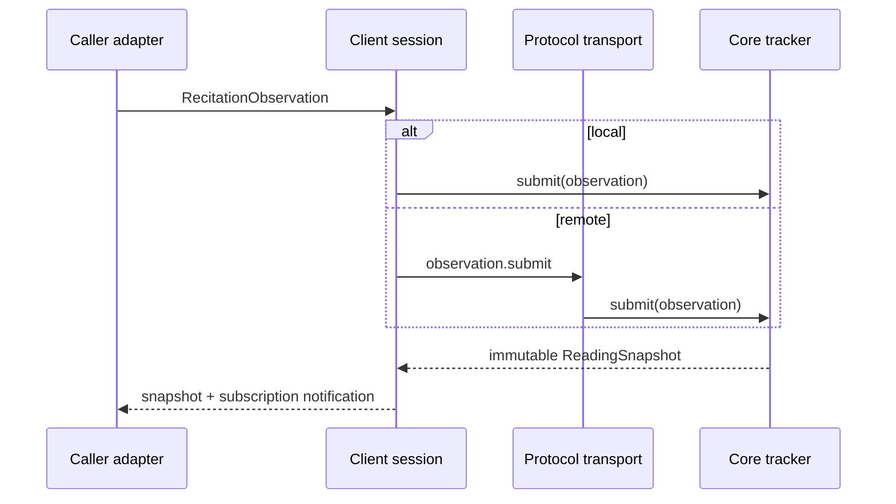

# Architecture

QARAA separates deterministic reading-state logic from transport and recognition integration. The direction of dependencies is deliberate: adapters provide normalized observations, the core decides alignment and progress, and transport packages serialize the resulting snapshots.

## Package responsibilities

### Core

`@atqan/qaraa-core` validates and indexes `QuranCorpus`, aligns observation phonemes against reference symbols, scores candidate evidence, applies confidence gates, classifies confirmed substitutions, and owns the `ReadingTracker` state machine. Its source audit rejects browser APIs, Node built-ins, frameworks, network clients, and imports from the other QARAA packages.

Snapshots separate display progress from committed progress. Display may move to a confidently located hypothesis; commit only completes fully consumed words with a final observation or the required partial lookahead. Repeated observation IDs and stale source revisions return the current state without advancing it.

### Protocol

`@atqan/qaraa-protocol` defines protocol v1 commands, events, errors, six JSON Schemas, and AJV-backed validators. Protocol messages are JSON-safe. Package semver does not change `PROTOCOL_VERSION`; breaking serialized changes require protocol v2 and new conformance fixtures.

### Client

`@atqan/qaraa-client` presents `QaraaSession` for both local and remote execution. `createLocalSession` wraps the synchronous tracker. `createRemoteSession` accepts fetch- and WebSocket-compatible transports from the caller, validates received events, retries eligible transport failures, deduplicates submissions, and ignores snapshots that do not advance revision.

### Server

`@atqan/qaraa-server` embeds a `SessionService` behind Fastify REST and WebSocket routes. `MemorySessionStore` is the default. A caller may provide the corpus resolver, session store, ID source, tracker factory, and error logger; no built-in authentication or durable-storage policy is present.

The fixed caller-supplied corpus is validated, copied, frozen, and indexed once on first use, then that immutable index and its prepared tracker lookup data are shared across isolated per-session state machines. Resolver callbacks still run for each creation; their results are not retained in an unbounded cache. `maxSessions` and `maxSubscribers` configure service-wide capacity (defaults: 1,024 live sessions and 4,096 live subscribers). Capacity reservations include in-flight creation, roll back on failure, and are released on session deletion or subscriber unsubscribe/socket close. Exhaustion uses a safe retryable `INTERNAL_ERROR` envelope with structured capacity details because protocol v1 adds no new error code.

### Optional Sherpa normalizer

`@atqan/qaraa-sherpa-onnx` accepts a structural result with tokens and optional timestamp/probability arrays. The caller provides `tokenMapper`; the package neither imports Sherpa nor loads a model. See [sherpa-onnx.md](sherpa-onnx.md).

## Data flow

## State and failure boundaries

- Corpus and observation validation rejects malformed structures and semantic resource-limit violations before candidate lookup or alignment allocation.
- Core state is per tracker and synchronous; server session operations are serialized per session.
- Protocol errors expose only typed safe details. Unexpected server errors become `INTERNAL_ERROR` while a caller-provided logger receives diagnostics.
- Remote retry behavior is limited to transport failures marked retryable. Typed protocol failures are not converted into transport successes.
- In-memory server snapshots, observation IDs, sessions, and subscribers are bounded; this is lifecycle continuity, not durable persistence.

## Distribution boundary

Each public package emits a CJS implementation, a thin ESM facade over that implementation, and matching `.d.cts`/`.d.mts` declarations. Both module loaders therefore share class and singleton identity instead of evaluating two independent implementations. Release smoke tests install the packed archives—not workspace links—before checking runtime exports and TS 7 consumers.
